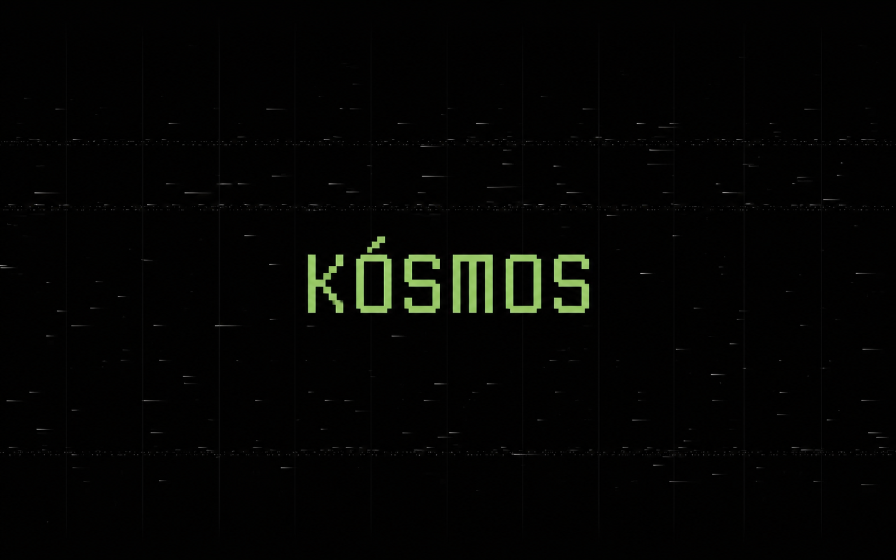

# Kósmos

An ordered, keyboard-first macOS environment inspired by the workflow and visual cohesion of Omarchy.



Kósmos combines automatic window tiling, fast workspace navigation, a custom status bar, persistent terminal sessions, a polished terminal editor, and modern command-line tools. It is an independent community project—not an official Omarchy port or distribution.

## What it installs

- **yabai + skhd** — BSP tiling and keyboard-driven window control
- **SketchyBar** — desktops, focused app, battery, and time
- **Ghostty + tmux** — fast terminal and persistent sessions
- **Neovim + LazyVim** — polished keyboard-first editing
- **Yazi** — terminal file manager
- **Raycast** — application launcher and system command center
- **Lazygit, GitHub CLI, Delta** — Git workflow
- **ripgrep, fd, jq, mise** — modern developer utilities
- **Firecrawl CLI** — web search and extraction tooling
- **JetBrainsMono Nerd Font** and a Catppuccin Macchiato terminal theme

## Requirements

- macOS on Apple Silicon (Intel may work but is not yet tested)
- An administrator account
- Internet access
- Roughly 15 minutes, including macOS permission approval

## Install

Clone the repository so you can inspect exactly what will run:

```sh
git clone https://github.com/therealasclepius/kosmos-macos.git
cd kosmos-macos
./install.sh
```

Preview every installation action without changing the computer:

```sh
./install.sh --dry-run
```

The installer backs up existing managed configuration files under:

```text
~/.local/state/kosmos/backups/
```

## Required macOS permissions

Apple does not permit installers to approve privacy access. After installation, run:

```sh
./scripts/permissions.sh
```

Enable yabai, skhd, and your terminal under **System Settings → Privacy & Security → Accessibility**. If prompted, enable SketchyBar under **Screen & System Audio Recording**. Restart the affected applications afterward.

Then verify the environment:

```sh
./scripts/doctor.sh
```

If the desktop stack ever stops responding, restart and verify it with:

```sh
./scripts/restart.sh
```

## Everyday use

Press `Option + Return` for Ghostty or `Shift + Option + Return` for the persistent `main` tmux workspace. Press `Shift + Option + Y` for Yazi and `Shift + Option + V` for Neovim.

See [docs/shortcuts.md](docs/shortcuts.md) for the complete key map.

## Update

```sh
./scripts/update.sh
```

## Uninstall

```sh
./uninstall.sh
```

The uninstaller removes only symlinks owned by this repository. Packages and system preferences remain in place to avoid unexpectedly deleting software or personal preferences. Pre-install files remain in the timestamped backup directory.

## Philosophy

Kósmos is Greek for order: a system whose parts form a coherent whole. The project brings that idea to macOS through sensible defaults, visible state, and a workflow that keeps both hands on the keyboard.

## License

MIT
